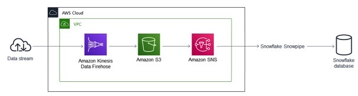

# Terraform solution to ingest streaming data into Snowflake using AWS Kinesis Firehose Delivery Stream & Snowflake's Snowpipe integration

## Goal
To demonstrate how terraform can be used to 

* Create Snowflake Resources
	* Warehouse
	* Database
	* Tables
	* External Stages
	* Snowpipe

* Create AWS resources like 
	* IAM Role
	* IAM Policy
	* S3 Bucket
	* S3 Bucket Event Notification
	* Kinesis Firehose Delivery Stream
* Configure the resources to deliver the stream from external sources (e.g. twitter) into snowflake using aws kinesis firehose delivery stream. 

## Assumptions and Prerequisites
* Developing on a Mac or Linux
* python version > 3 is [installed](https://www.python.org/downloads/)
* [Terraform (>v0.13) is installed](https://learn.hashicorp.com/tutorials/terraform/install-cli)
* You have setup your test [snowflake account](https://signup.snowflake.com/).
* Your command shell is configured with [aws credentials](https://thehomeofthefuture.com/how-to/aws-cli-on-macos-and-linux/) and allows you to create resources.
* To test the streaming ingestion, we will use twitter APIs and for that you need to have your [Twitter development account](https://dev.to/sumedhpatkar/beginners-guide-how-to-apply-for-a-twitter-developer-account-1kh7) and the various api keys
	* consumer key
	* consumer secret
	* access token
	* access token secret


## Breaking it down piece by piece

We will **NOT** use the code from repo, but rather write it & then deploy our terraform stack incrementally. Follow the steps below to roll out your stack incrementally.

### Set your environment variables in your working shell
Ensure that you have read the [assumptions and pre-requisistes](#assumptions-and-prerequisites).
We shall list at every stage which environment variables are needed in order to execute the terraform code and client successfully.
To start off with export the following variables:
```bash
export aws_region_id="ap-southeast-2"
#Any variable 'x' exported with 'TF_VAR_' (as in TF_VAR_x) prefixed to it, is interpreted by terraform as a terraform variable 'x' 
export twi_kinesis_firehose_stream_name="terraform-kinesis-firehose-twi-stream"
export TF_VAR_twi_kinesis_firehose_stream_name="${twi_kinesis_firehose_stream_name}"
export twi_s3_bucket_name="<your_bucket_name>"
export TF_VAR_twi_s3_bucket_name="${twi_s3_bucket_name}"
```

### Terraform it incrementally
Now that we have setup the environment with required variables let's proceed to build our terraform stack.
The best way to see how the whole stream delivery to snowflake is put in place, is to build & deploy the stack incrementally. Follow the steps and the explanation as we progress through each step.

## What the code structure will look like after we have finally build it

Terraform source:

```bash
.
├── scripts
│   └── get-twitter-streams.py
└── tf
    ├── main.tf
    ├── modules
    │   ├── iam-user-for-sf
    │   │   ├── main.tf
    │   │   ├── required_provider.tf -> ../../required_provider.tf
    │   │   └── variables.tf
    │   ├── kinesis-setup
    │   │   ├── firehose_access_policy.tf
    │   │   ├── main.tf
    │   │   ├── required_provider.tf -> ../../required_provider.tf
    │   │   └── variables.tf
    │   ├── s3bucket-for-sf
    │   │   ├── main.tf
    │   │   ├── required_provider.tf -> ../../required_provider.tf
    │   │   └── variables.tf
    │   └── snowflake-setup
    │       ├── main.tf
    │       ├── required_provider.tf -> ../../required_provider.tf
    │       └── variables.tf
    ├── provider.tf
    ├── required_provider.tf
    └── variables.tf
```
#### Choose a working folder on your machine
Since we are going to build this incrementally, let's build the terraform modules/resources one at a time.
First start by create a new folder. This will be our working folder.

```bash
cd ~
rm -rf ~/demo.env
mkdir -p ~/demo.env/tf
cd ~/demo.env
```

#### Create aws provider file
Terraform relies on plugins called "[providers](https://www.terraform.io/docs/language/providers/configuration.html)" to interact with remote systems.
Let's create the two files - one which declares the `required providers` and other which declares the `providers`.

```bash
cd ~/demo.env/tf
# create 'required_provider.tf' file here. See output of following cat command for the content of the file.
cat required_provider.tf
```
```hcl
terraform {
  required_providers {
    aws = {
      source  = "hashicorp/aws"
      version = "3.20.0"
    }
  }
}
```
```bash
cd ~/demo.env/tf
# create 'provider.tf' file here. See output of following cat command for the content of the file.
cat provider.tf
```
```hcl
# Configure the AWS Provider
provider "aws" {
  region = "ap-southeast-2"
}
```
Test the provider configuration by executing terraform init.

```bash
cd ~/demo.env/tf
terraform init
```
If you get `Terraform has been successfully initialized!` message then we can proceed further. If not check that you have terraform (>v0.13> installed and have defined the provider files properly.

#### Create s3 bucket

We need an s3 bucket to save the incoming streams as json files.    
Here we shall define a terraform module named as `s3bucket-for-sf` which will used to create the s3 bucket. IN the module we shall create its variables, resource & output files.
Note: We will also create a soft link from within the module to the `required providers` file - this is something terraform needs when working with modules. We will do this for every new module that we define.

```sh
mkdir -p ~/demo.env/tf/modules/s3bucket-for-sf
cd ~/demo.env/tf/modules/s3bucket-for-sf
#creating the soft link to required provider
ln -snf ../../required_provider.tf required_provider.tf
# create 'variables.tf' file here. See output of following cat command for the content of the file.
cat variables.tf
```
```hcl
variable "s3_bucket_name" { type = string }
```
```bash
cd ~/demo.env/tf/modules/s3bucket-for-sf
# create 'main.tf' file here. See output of following cat command for the content of the file.
cat main.tf
```
```hcl
resource "aws_s3_bucket" "twi_s3_bucket" {
  bucket = var.s3_bucket_name
  acl = "private"
  tags = {
    Name = var.s3_bucket_name
  }
  force_destroy = true
}

output "arn" {
  value = aws_s3_bucket.twi_s3_bucket.arn
}

output "id" {
  value = aws_s3_bucket.twi_s3_bucket.id
}

output "bucket" {
  value = aws_s3_bucket.twi_s3_bucket.bucket
}
```

Define your variable file and main file in your working directory which will invoke the `s3bucket-for-sf` terraform module.

```bash
cd ~/demo.env/tf
# create 'variables.tf' file here. See output of following cat command for the content of the file.
cat variables.tf
```
```hcl
variable "twi_s3_bucket_name" {
  type = string
  default = "damz-twi-s3-bucket-1"
}
```
```bash
cd ~/demo.env/tf
# create 'main.tf' file here. See output of following cat command for the content of the file.
cat main.tf
```
```hcl
module "s3bucket-for-sf" {
  source = "./modules/s3bucket-for-sf"
  s3_bucket_name = var.twi_s3_bucket_name
}
```

Roll out the stack by executing terraform commands.

```bash
cd ~/demo.env/tf
terraform init
#run terraform plan to see what resources will be created/added
terraform plan
#create the resources
terraform apply --auto-approve
```

If all goes well, you will see the following message:    
`Apply complete! Resources: 1 added, 0 changed, 0 destroyed.`

At this stage your s3 bucket is created.

#### Create Kinesis Firehose Delivery Stream and link it to S3 Bucket
Amazon Kinesis Data Firehose is an automatically scalable, fully managed aws service that allows you to reliably capture, transform, and deliver streaming data into data lakes, data stores, and analytics services.
We will use Kinesis firehose to capture and send data into our s3 bucket that we have created above. Here we will write a terraform module `kinesis-setup` to create & configure Amazo Kinesis Firehose delivery stream.
The module will set up the following:

* IAM role with attached policy that will allow firehose to 
	* assume an IAM Role
	* write data into s3 bucket
	* write logs into cloudwatch
* AWS kinesis firehose delivery stream - which sends data to s3 & logs to cloudwatch

Let's define the module `kinesis-setup` code

```bash
mkdir -p ~/demo.env/tf/modules/kinesis-setup
cd ~/demo.env/tf/modules/kinesis-setup
#creating the soft link to required provider
ln -snf ../../required_provider.tf required_provider.tf
# create 'variables.tf' file here. See output of following cat command for the content of the file.
cat variables.tf
```
```hcl
variable "bucket_arn" { type = string }
variable "kinesis_firehose_stream_name" { type = string }
```

```bash
cd ~/demo.env/tf/modules/kinesis-setup
# create 'firehose_access_policy.tf' file here. See output of following cat command for the content of the file.
cat firehose_access_policy.tf
```
```hcl
#Define a policy which will allow Kinesis Data Firehose to Assume an IAM Role
data "aws_iam_policy_document" "kinesis_firehose_stream_assume_role" {
  statement {
    effect  = "Allow"
    actions = ["sts:AssumeRole"]
    principals {
      type        = "Service"
      identifiers = ["firehose.amazonaws.com"]
    }
  }
}

#Define a policy which will allow Kinesis Data Firehose to access your S3 bucket
data "aws_iam_policy_document" "kinesis_firehose_access_bucket_assume_policy" {
  statement {
    effect = "Allow"
    actions = [
      "s3:AbortMultipartUpload",
      "s3:GetBucketLocation",
      "s3:GetObject",
      "s3:ListBucket",
      "s3:ListBucketMultipartUploads",
      "s3:PutObject",
    ]
    resources = [
      var.bucket_arn,
      "${var.bucket_arn}/*",
    ]
  }
}

#Define a policy which will allow Kinesis Data Firehose to send logs to cloudwatch
#The resource group can be further controlled ...for now allowing every action
data "aws_iam_policy_document" "kinesis_firehose_cw_policy" {
  statement {
    effect = "Allow"
    actions = [
      "logs:CreateLogGroup",
      "logs:CreateLogStream",
      "logs:PutLogEvents"
    ]
    resources = [
      "arn:aws:logs:*:*:*"
    ]
  }
}
```
```bash
cd ~/demo.env/tf/modules/kinesis-setup
# create 'main.tf' file here. See output of following cat command for the content of the file.
cat main.tf
```
```hcl
#creates a new iam role
resource "aws_iam_role" "firehose_role" {
  name               = "firehose_role"
  assume_role_policy = data.aws_iam_policy_document.kinesis_firehose_stream_assume_role.json
}

#attach s3 bucket access policy
resource "aws_iam_role_policy" "kinesis_firehose_access_bucket_policy" {
  name   = "kinesis_firehose_access_bucket_policy"
  role   = aws_iam_role.firehose_role.name
  policy = data.aws_iam_policy_document.kinesis_firehose_access_bucket_assume_policy.json
}

#attach send logs to cloudwatch policy
resource "aws_iam_role_policy" "kinesis_firehose_send_logs_to_cw_policy" {
  name   = "kinesis_firehose_send_logs_to_cw_policy"
  role   = aws_iam_role.firehose_role.name
  policy = data.aws_iam_policy_document.kinesis_firehose_cw_policy.json
}

resource "aws_kinesis_firehose_delivery_stream" "fh_stream" {
  name        = var.kinesis_firehose_stream_name
  destination = "s3"
  s3_configuration {
    role_arn   = aws_iam_role.firehose_role.arn
    bucket_arn = var.bucket_arn
    buffer_size        = 1
    buffer_interval    = 60
    cloudwatch_logging_options {
      enabled = true
      log_group_name = "/aws/kinesisfirehose/${var.kinesis_firehose_stream_name}"
      log_stream_name = "S3Delivery"
    }
  }
}
```

Update the your variable file and main file in your working directory to include invocation of the `kinesis-setup` module.

```bash
cd ~/demo.env/tf
# update the 'variables.tf' file here. See output of following cat command for the content of the file.
cat variables.tf
```
```hcl
variable "twi_s3_bucket_name" {
  type = string
  default = "damz-twi-s3-bucket-1"
}

variable "twi_kinesis_firehose_stream_name" {
  type = string
  default = "terraform-kinesis-firehose-twi-stream"
}
```
```bash
cd ~/demo.env/tf
# update the 'main.tf' file here. See output of following cat command for the content of the file.
cat main.tf
```
```hcl
module "s3bucket-for-sf" {
  source = "./modules/s3bucket-for-sf"
  s3_bucket_name = var.twi_s3_bucket_name
}

module "kinesis-setup" {
  source = "./modules/kinesis-setup"
  bucket_arn = module.s3bucket-for-sf.arn
  kinesis_firehose_stream_name = var.twi_kinesis_firehose_stream_name
}
```

Update the stack by executing terraform commands.

```bash
cd ~/demo.env/tf
terraform init
#run terraform plan to see what resources will be created/added
terraform plan
#create the resources
terraform apply --auto-approve
```

If all goes well, you will see the following message:    
`Apply complete! Resources: 4 added, 0 changed, 0 destroyed.`

At this stage your kinesis firehose delivery stream bucket is created.

#### Create an IAM service account(user)
Snowflake needs access to the s3 bucket. Ideally a role is created to allow cross account access from snowflake to our aws account. But for the sake of simplicity we will use an IAM service account(user) with read only access to the s3 bucket. We shall also create the access keys for this service account, which we will later need to configure at the end of snowflake.
We proceed to create the `iam-user-for-sf` module.

```bash
mkdir -p ~/demo.env/tf/modules/iam-user-for-sf
cd ~/demo.env/tf/modules/iam-user-for-sf
#creating the soft link to required provider
ln -snf ../../required_provider.tf required_provider.tf
# create the 'variables.tf' file here. See output of following cat command for the content of the file.
cat variables.tf
```
```hcl
variable "iam_username" { type = string }
variable "s3bucket_arn" { type = string }
```

```bash
# create the 'main.tf' file here. See output of following cat command for the content of the file.
cd ~/demo.env/tf/modules/iam-user-for-sf
cat main.tf
```
```hcl
data "aws_iam_policy_document" "s3_read_policy" {
  statement {
    effect = "Allow"
    actions = [
      "s3:Get*",
      "s3:List*"
    ]
    resources = [
      var.s3bucket_arn,
      "${var.s3bucket_arn}/*",
    ]
  }
}

resource "aws_iam_user" "sfuser" {
  name = var.iam_username
}

resource "aws_iam_user_policy" "sfuser_s3ropolicy" {
  name = "sfuser_s3ropolicy"
  user = aws_iam_user.sfuser.name
  policy = data.aws_iam_policy_document.s3_read_policy.json
}

resource "aws_iam_access_key" "sfuseraccesskey" {
  user    = aws_iam_user.sfuser.name
}

output "id" {
  value = aws_iam_access_key.sfuseraccesskey.id
}

output "secret" {
  value = aws_iam_access_key.sfuseraccesskey.secret
}
```
Above code will create an iam policy that allows read only permission to the specified s3 bucket, associates the policy with a newly created iam user and also provides the access key and secret for that user.

Update your variable file and main file in your working directory to include invocation of the `iam-user-for-sf` module.

```bash
cd ~/demo.env/tf
# update the 'variables.tf' file here. See output of following cat command for the content of the file.
cat variables.tf
```
```hcl
variable "twi_s3_bucket_name" {
  type = string
  default = "damz-twi-s3-bucket-1"
}

variable "twi_kinesis_firehose_stream_name" {
  type = string
  default = "terraform-kinesis-firehose-twi-stream"
}

variable "iam_username_for_sf" {
  type = string
  default = "sfusers3ro"
}
```
```bash
cd ~/demo.env/tf
# update the 'main.tf' file here. See output of following cat command for the content of the file.
cat main.tf
```
```hacl
module "s3bucket-for-sf" {
  source = "./modules/s3bucket-for-sf"
  s3_bucket_name = var.twi_s3_bucket_name
}

module "kinesis-setup" {
  source = "./modules/kinesis-setup"
  bucket_arn = module.s3bucket-for-sf.arn
  kinesis_firehose_stream_name = var.twi_kinesis_firehose_stream_name
}

module "iam-user-for-sf" {
  source = "./modules/iam-user-for-sf"
  iam_username = var.iam_username_for_sf
  s3bucket_arn = module.s3bucket-for-sf.arn
}
```

Update the stack by executing terraform commands.

```bash
cd ~/demo.env/tf
terraform init
#run terraform plan to see what resources will be created/added
terraform plan
#create the resources
terraform apply --auto-approve
```
If all goes well, you will see the following message:
`Apply complete! Resources: 3 added, 0 changed, 0 destroyed.`


#### Create snowflake resources
Assumption here is that you have setup your [snowflake account](https://signup.snowflake.com/).
[Terraform](https://registry.terraform.io/providers/chanzuckerberg/snowflake/latest/docs) distributes a [snowflake provider](https://github.com/chanzuckerberg/terraform-provider-snowflake) for managing Snowflake accounts. We can simply define `required_providers` & `provider` in our terraform code to start using the snowflake provider. Assuming that you have details such as snowflake account id, account user name and password with privileges that allows you to create & manage resources in snowflake. For simplicity we will be using a root account operating under ACCOUNTADMIN role.

##### Snowflake providers
First let's update the provider files as shown below:

```bash
cd ~/demo.env/tf
# update the 'required_provider.tf' file here. See output of following cat command for the content of the file.
cat required_provider.tf
```
```hcl
terraform {
  required_providers {
    aws = {
      source  = "hashicorp/aws"
      version = "3.20.0"
    }
    snowflake = {
      source = "chanzuckerberg/snowflake"
      version = "0.20.0"
    }
  }
}
```
```bash
# update the 'required_provider.tf' file here. See output of following cat command for the content of the file.
cd ~/demo.env/tf
cat provider.tf
```
```hcl
# Configure the AWS Provider
provider "aws" {
  region = "ap-southeast-2"
}

provider "snowflake" {
  region  = "ap-southeast-2"
  role = "ACCOUNTADMIN"
}
```
At this stage it may be a good idea to test your provider configuration by executing terraform init.

```bash
cd ~/demo.env/tf
terraform init
```
If you see something like `Installing chanzuckerberg/snowflake v0.20.0...` followed by get `Terraform has been successfully initialized!` message then we can proceed further. If not, check that you have terraform installed and have defined the provider files properly.

##### Snowflake account credentials
There are multiple ways you can authenticate against snowflake but we will test with simple password based authentication. 
Please ensure that account credentials like account number, user name and password are defined as part of your environment. Terraform snowflake provider relies on these environment variable.

```bash
export SNOWFLAKE_ACCOUNT="<your account>"
export SNOWFLAKE_USER="<your user name>"
export SNOWFLAKE_PASSWORD="<your password>"
```

##### Create snowflake resources
We will now define the `snowflake-setup` terraform module that will create snowflake resources
This module needs the following inputs:

variable                 | description
----------------------   | -------------
`external_s3_bucket`     | The s3 bucket name from which snowflake will read data
`aws_region_id `         | Region ID
`aws_access_key_id`      | The access key id of the iam service account which allows read only access to the s3 bucket
`aws_secret_access_key`  | The secret access key of the iam service account which allows read only access to the s3 bucket.

For the sake of simplicity we will use the following hardcoded names for our snowflake resources that we will create:

snowflake resource       | name
-------------------------| -------------
Warehouse                | TWI_WH
Database                 | TWIDB
Schema                   | PUBLIC
Table                    | TWEETS
External Stage           | TWITTER_STAGE
Snowpipe                 | snowpipe

Proceed to create the `snowflake-setup` module as shown below

```bash
mkdir -p ~/demo.env/tf/modules/snowflake-setup
cd ~/demo.env/tf/modules/snowflake-setup
#creating the soft link to required provider
ln -snf ../../required_provider.tf required_provider.tf
# create the 'variables.tf' file here. See output of following cat command for the content of the file.
cat variables.tf
```
```hcl
variable "aws_access_key_id" { type = string }
variable "aws_secret_access_key" { type = string }
variable "external_s3_bucket" { type = string }
```
```bash
# create the 'main.tf' file here. See output of following cat command for the content of the file.
cd ~/demo.env/tf/modules/snowflake-setup
cat main.tf
```
```hcl
locals {
  file_format = " file_format=(type='JSON')"
}

resource "snowflake_warehouse" "TWI_WH" {
  name           = "TWI_WH"
  comment        = "twitter analysis wh"
  warehouse_size = "XSMALL"
  auto_suspend   = 120
  auto_resume    = true
}

resource "snowflake_database" "TWIDB" {
  name                        = "TWIDB"
  comment                     = "Twitter DB"
  data_retention_time_in_days = 1
}

#creates a snowflake table. Notice the data type of column is a variant type which allows us to store json like data
resource "snowflake_table" "TWI_TABLE" {
  database = snowflake_database.TWIDB.name
  schema   = "PUBLIC"
  name     = "TWEETS"
  comment  = "Twitter streams data table."
  column {
    name = "tweet"
    type = "VARIANT"
  }
}
#Creates snowflake external stage from (s3) which snowpipe will read data files
#we are using aws access keys here to allow access to s3, but as mentioned earlier
#external IAM roles can be used to manage the cross account access control in a better way.
#Refer https://docs.snowflake.com/en/user-guide/data-load-snowpipe-auto-s3.html
resource "snowflake_stage" "external_stage_s3" {
  name        = "TWITTER_STAGE"
  url         = join("", ["s3://", var.external_s3_bucket, "/"])
  database    = snowflake_database.TWIDB.name
  schema      = "PUBLIC"
  credentials = "AWS_KEY_ID='${var.aws_access_key_id}' AWS_SECRET_KEY='${var.aws_secret_access_key}'"
}

#create pipe to copy into the tweets table from the external stage
resource "snowflake_pipe" "snowpipe" {
  name     = "snowpipe"
  database = snowflake_database.TWIDB.name
  schema   = "PUBLIC"
  comment  = "This is the snowpipe that will consume kinesis delivery stream channelled via the sqs."
  copy_statement = join("", [
    "copy into ",
    snowflake_database.TWIDB.name, ".PUBLIC.", snowflake_table.TWI_TABLE.name,
    " from @",
    snowflake_database.TWIDB.name, ".PUBLIC.", snowflake_stage.external_stage_s3.name,
    local.file_format
  ])
  auto_ingest = true
}

output "sqs_4_snowpipe" {
  value = snowflake_pipe.snowpipe.notification_channel
}
```
**Note:** The `snowflake-setup` module's output `sqs_4_snowpipe` gives us the sqs notification chanel that we will configure later in our s3 bucket for event notifications.

Update your main file under our working directory to include invocation of the `snowflake-setup` module. Note how we are passing the iam user access credentials as input to the snowflake-setup module.

```bash
cd ~/demo.env/tf
# update the 'main.tf' file here. See output of following cat command for the content of the file.
cat main.tf
```
```hcl
module "s3bucket-for-sf" {
  source = "./modules/s3bucket-for-sf"
  s3_bucket_name = var.twi_s3_bucket_name
}

module "kinesis-setup" {
  source = "./modules/kinesis-setup"
  bucket_arn = module.s3bucket-for-sf.arn
  kinesis_firehose_stream_name = var.twi_kinesis_firehose_stream_name
}

module "iam-user-for-sf" {
  source = "./modules/iam-user-for-sf"
  iam_username = var.iam_username_for_sf
  s3bucket_arn = module.s3bucket-for-sf.arn
}

module "snowflake-setup" {
  source = "./modules/snowflake-setup"
  aws_access_key_id = module.iam-user-for-sf.id
  aws_secret_access_key = module.iam-user-for-sf.secret
  external_s3_bucket = module.s3bucket-for-sf.bucket
}
```

Update the stack by executing terraform commands.

```bash
cd ~/demo.env/tf
terraform init
#run terraform plan to see what resources will be created/added
terraform plan
#create the resources
terraform apply --auto-approve
```

If all goes well, you will see the following message:
`Apply complete! Resources: 5 added, 0 changed, 0 destroyed.`

#### Finally configure s3 bucket's all object create events to notify snowpipe's sqs queue

Update your main file under our working directory to configure s3 bucket's all object create events to notify snowpipe's sqs queue.
Unlike previous cases where we invoke terraform module, this time we shall directly specify 'aws_s3_bucket_notification' resource creation directive.
```bash
cd ~/demo.env/tf
# update the 'main.tf' file here. See output of following cat command for the content of the file.
cat main.tf
```
```hcl
module "s3bucket-for-sf" {
  source = "./modules/s3bucket-for-sf"
  s3_bucket_name = var.twi_s3_bucket_name
}

module "kinesis-setup" {
  source = "./modules/kinesis-setup"
  bucket_arn = module.s3bucket-for-sf.arn
  kinesis_firehose_stream_name = var.twi_kinesis_firehose_stream_name
}

module "iam-user-for-sf" {
  source = "./modules/iam-user-for-sf"
  iam_username = var.iam_username_for_sf
  s3bucket_arn = module.s3bucket-for-sf.arn
}

module "snowflake-setup" {
  source = "./modules/snowflake-setup"
  aws_access_key_id = module.iam-user-for-sf.id
  aws_secret_access_key = module.iam-user-for-sf.secret
  external_s3_bucket = module.s3bucket-for-sf.bucket
}

resource "aws_s3_bucket_notification" "bucket_notification_to_sqs" {
  bucket = module.s3bucket-for-sf.id
  queue {
    queue_arn     = module.snowflake-setup.sqs_4_snowpipe
    events        = ["s3:ObjectCreated:*"]
  }
}
```

Update the stack by executing terraform commands.

```bash
cd ~/demo.env/tf
terraform init
#run terraform plan to see what resources will be created/added
terraform plan
#create the resources
terraform apply --auto-approve
```
If all goes well, you will see the following message:
`Apply complete! Resources: 1 added, 0 changed, 0 destroyed.`


At this stage we have created the kinesis firehose delivery stream pipeline to snowflake as shown here: 

#### How can I test this?

We can test this by running a python utility which will read twitter stream and in turn will forward the data to the specified kinesis firehose stream.
Assumption here is that you have

* [Installed python3 ](https://www.python.org/downloads/) on your system.
* [Twitter Development](https://dev.to/sumedhpatkar/beginners-guide-how-to-apply-for-a-twitter-developer-account-1kh7) credentials for the application to connect to twitter APIs
* The environment in which program will run will export the the aws access key and secret that will allow the program to talk to aws firehose.

We will need to install a couple of python library in order to run the python program.

```bash
#Install Twitter's tweepy library
python3 -m pip install tweepy

#Install AWS’s Boto3 library
python3 -m pip install boto3
```

The following environment variables should be defined with proper values for the program to run the test client successfully. Of course there are ways to handle these value programatically but that's out of scope in this discussion.

```bash
#export the aws access keys (assuming that you have configured your aws cli - https://docs.aws.amazon.com/cli/latest/userguide/cli-configure-files.html)
export aws_region_id="ap-southeast-2"
export aws_access_key_id="<your value>"
export aws_secret_access_key="<your value>"

#export the twitter api keys
export twi_consumer_key="<your value>"
export twi_consumer_secret="<your value>"
export twi_access_token="<your value>"
export twi_access_token_secret="<your value>"

#the kinesis firehose name - use the same name as defined below
export twi_kinesis_firehose_stream_name="terraform-kinesis-firehose-twi-stream"
```

Create the python script to read twitter streams and forward the same to firehose:
```bash
mkdir ~/demo.env/scripts
cd ~/demo.env/scripts
# create the 'get-twitter-streams.py' file here. See output of following cat command for the content of the file.
cat get-twitter-streams.py
```
```python
import os
import json
import boto3
from tweepy import OAuthHandler, Stream, StreamListener

def check_empty(varname, varval):
  if not varval:
    print("Unexpected empty Value: {0}".format(varname))
    exit(1)

#read env variables
kinesis_delivery_stream_name = os.getenv("twi_kinesis_firehose_stream_name")
check_empty("kinesis_delivery_stream_name", kinesis_delivery_stream_name)

twi_consumer_key = os.getenv("twi_consumer_key")
check_empty("twi_consumer_key", twi_consumer_key)

twi_consumer_secret = os.getenv("twi_consumer_secret")
check_empty("twi_consumer_secret", twi_consumer_secret)

twi_access_token = os.getenv("twi_access_token")
check_empty("twi_access_token", twi_access_token)

twi_access_token_secret = os.getenv("twi_access_token_secret")
check_empty("twi_access_token_secret", twi_access_token_secret)

aws_region_id = os.getenv("aws_region_id")
check_empty("aws_region_id", aws_region_id)

aws_access_key_id = os.getenv("aws_access_key_id")
check_empty("aws_access_key_id", aws_access_key_id)

aws_secret_access_key = os.getenv("aws_secret_access_key")
check_empty("aws_secret_access_key", aws_secret_access_key)

#In case you are using temporary token/creds you will need the session token
aws_session_token = os.getenv("aws_session_token")
if not aws_session_token:
  session = boto3.Session(
    aws_access_key_id=aws_access_key_id,
    aws_secret_access_key=aws_secret_access_key,
    region_name=aws_region_id
  )
else:
  session = boto3.Session(
    aws_access_key_id=aws_access_key_id,
    aws_secret_access_key=aws_secret_access_key,
    aws_session_token=aws_session_token,
    region_name=aws_region_id
  )

kinesis_client = session.client('firehose')

def sendToStream(data):
  response = kinesis_client.put_record(
      DeliveryStreamName = kinesis_delivery_stream_name,
      Record = {
          'Data': data.encode()
      }
  )
  return response

class StdOutListener(StreamListener):
  def on_data(self, data):
    print(data)
    response = sendToStream(data)
    return True

  def on_error(self, status):
    if status == 420:
      return False


listnr = StdOutListener()

#twitter - capture stream
auth = OAuthHandler(twi_consumer_key, twi_consumer_secret)
auth.set_access_token(twi_access_token, twi_access_token_secret)
stream = Stream(auth=auth, listener=listnr)
stream.filter(track=['cricket'])
```

before we execute the program just a word of caution. Don't leave the program running for longer thna necessary time. This is to make sure that you do not accidentally end up pay for your accidental usage.
As soon as you have tested the client, terminate the client program.

Let's proceed to execute the above program:

```bash
cd ~/demo.env
python3 scripts/get-twitter-streams.py
```

If all goes well, you will see a lot of twitter stream data output on your stdout and at the same time the data is being forwarded to kinesis firehose and in turn to s3 bucket.
Open the s3 bucket via your aws console (or using aws cli) and you will see that there a few files are being created.
Login to your snowflake account and switch to ACCOUNTADMIN role. Check the tweets table that we created. You can use the following simple query to check the number of records in the table. You see multiple rows of json data which is nothing but the twitter stream records.
```sql
select count(*) from TWIDB.PUBLIC.TWEETS;
```

You can perform further analysis on the data that is collected and gather insights.

### Destroying the environment
It's important to delete your resources if you are not using it so as to avoid unnecessary costs.
Terminate the python program by pressing CTRL^C on your console.
And simply execute terraform destroy.

```bash
cd ~/demo.env/tf
terraform init
#destroy all the resources
terraform destroy --auto-approve
```

## A lot more to consider...
Here we have just attempted to introduce how terraform can be used to achieve our goals. It  is not a comprehensive solution in any manner.
There is a much more to consider when developing such solutions, some of which are:
* Restrict Access control (IAM) to minimum
* Cost efficiency
* Data Protection - Encryption @Rest & in Transit
* Backup
* Data Transformation
* Secure Data Handling
* Terraform state management
* ...and more
